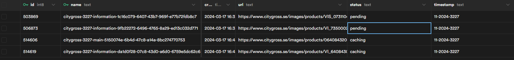

# Image Scaler using Supabase

This tool is designed for Supabase projects to automate image resizing and management. It downloads images from a MySQL table, resizes them based on set criteria, and re-uploads them to Supabase Storage. Additionally, it features an HTTP server for serving and caching image links and offers insights into the image processing status, streamlining the workflow for managing digital assets.

## Table of Contents

- [Installation](#installation)
- [Usage](#usage)
- [Database Schema](#database-schema)
- [Storage Configuration](#storage-configuration)
- [Example Database rows](#example-database-rows)

## Installation

- Clone git repository
- Rename `.env.example` to `.env`
- Set environment variables to expected values
- Run the program using `go run main.go`

## Usage

Begin by establishing your Supabase project environment. This involves creating a dedicated table named `cache_pending_images` which should include the following columns: `name`, `url`, `status`, and `id`. This table plays a crucial role in managing the images awaiting processing.

**Operational Workflow:**

1. **Image Detection and Status Update:**

   - Utilize goroutines to monitor the `cache_pending_images` table every 10 seconds for entries marked with a "pending" status, indicating images ready for caching.
   - Upon discovery, the status of these entries will be updated to "caching," and the associated image details are sent to a processing channel.

2. **Image Processing:**

   - Separate goroutines are responsible for retrieving image details from the channel, downloading the respective images to a local directory, and then resizing them according to specific rules:
     - Images with `name` containing "main" are resized to 256x256 pixels.
     - Images with `name` containing "information" are resized to 512x512 pixels.

3. **Image Uploading:**
   - Once resized, these images are uploaded back to Supabase Storage for persistent storage and access.

**HTTP Server and Image Retrieval:**

- An HTTP server is initiated, listening on a port specified within the `.env` configuration file.
- For real-time status updates on image processing, send a GET request to `/status?amount=50`. This endpoint returns the number of images currently being processed, tracked over 50 intervals ("ticks").
- To retrieve a specific image, whether in the process of scaling or already completed, use the endpoint `/v2/store/{store}/image/{storeId}/{type}/{id}`. This request is internally redirected to `/v2/file/{store}/{storeId}/{type}/{id}`, where the actual file is served. The initial request plays a vital role in caching the subsequent file retrieval path in a Redis cache for 10 hours, optimizing access times and reducing load.

## Database Schema

### Table: `cache_pending_images`

This table queues images for processing and tracks their status.

#### SQL Creation Script

```sql
CREATE TABLE public.cache_pending_images (
    id BIGINT GENERATED BY DEFAULT AS IDENTITY,
    created_at TIMESTAMP WITH TIME ZONE NOT NULL DEFAULT now(),
    name TEXT NOT NULL,
    url TEXT NOT NULL,
    status TEXT NOT NULL,
    timestamp TEXT NOT NULL DEFAULT ''::text,
    CONSTRAINT cache_pending_images_pkey PRIMARY KEY (id, name),
    CONSTRAINT cache_pending_images_name_key UNIQUE (name)
) TABLESPACE pg_default;
```

- **Purpose**: Manages and tracks images from entry to processing.
- **Constraints**: Ensures data integrity and uniqueness.

## Storage Configuration

### Bucket: `images`

Ensure a bucket named `images` is set up in your storage solution for storing processed images.

- **Usage**: Stores resized images for easy access and management.

## Example Database rows


